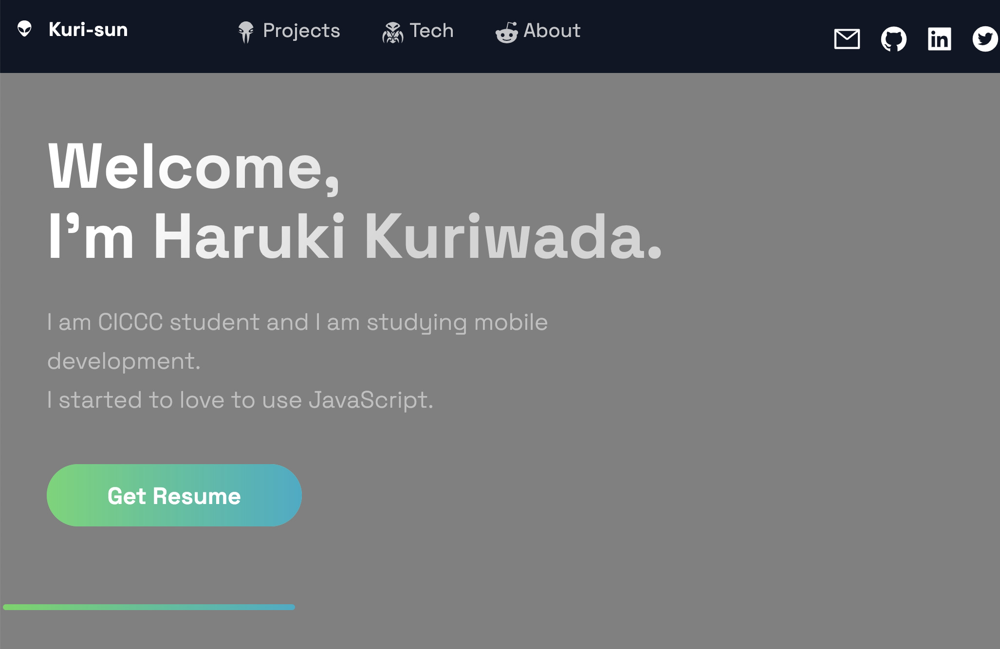
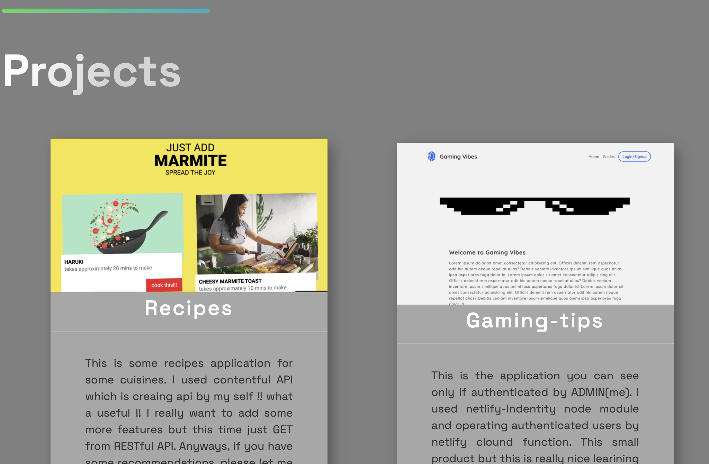
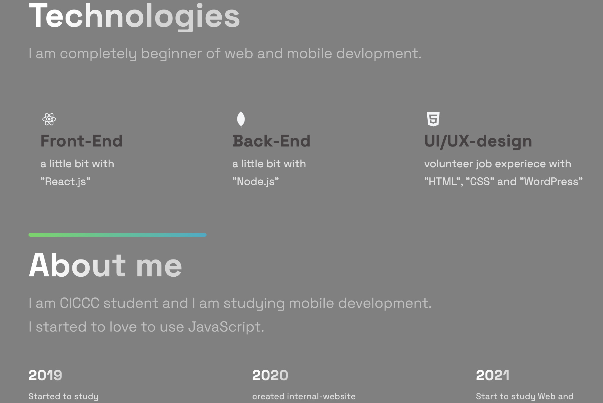
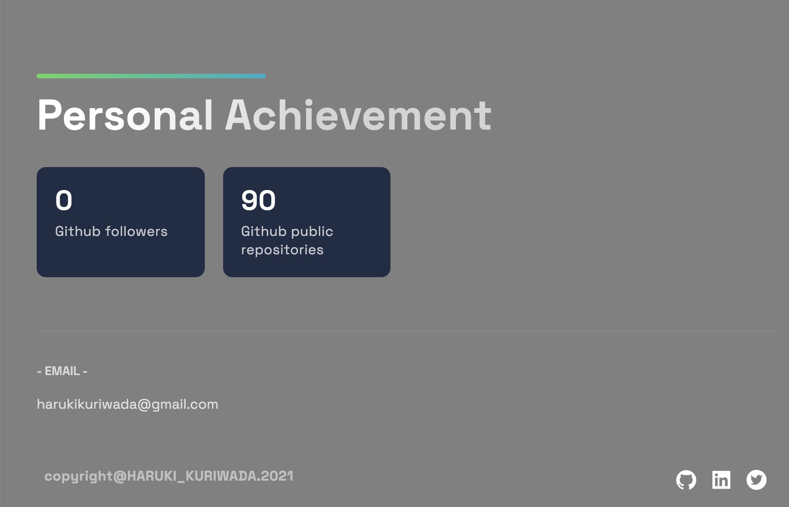
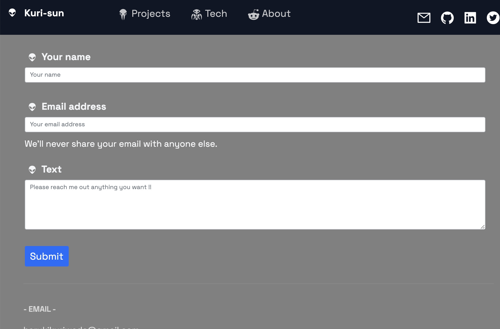

# My personal Website !!

Finally!! I create website based on a lot of other's website.😁😁😁

### I used ...

- ⚡️ Next.js
- ⚡️ Vercel
- ⚡️ Nodemailer
- ⚡️ MongoDB
- ⚡️ useSWR
- ⚡️ Github-API

  
  
  

### featured ...

- I personally like useSWR() library is favirate because with mongoDB, data fetching sometimes do takes a time but with useSWR() user experience are so great I think and if users open as many tabs as possible, we can caching fetched data by useSWR. How nice work this is!!!
- loading icon is pretty 😻

 
 
 Anyways, it looks like this
  
  

### 1. Landing page

 

### 2. Products I have created.

  

### 3. Teachnologies I mainly use.

   

### 4. Some achivements ... (now nothing ... haha...)

   

### 5. Mailer feature

  

Thank reading through !!!
I want to create useful applications more and more ...!!
