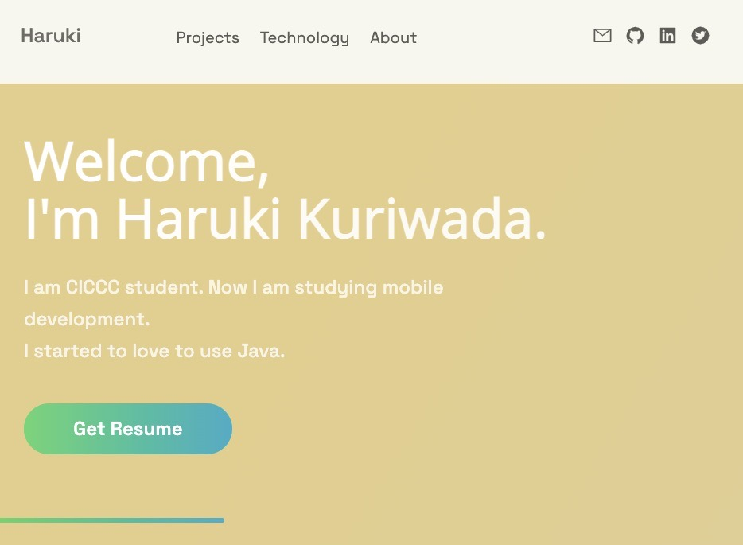
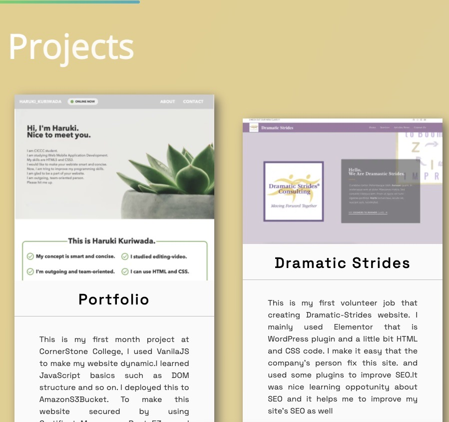
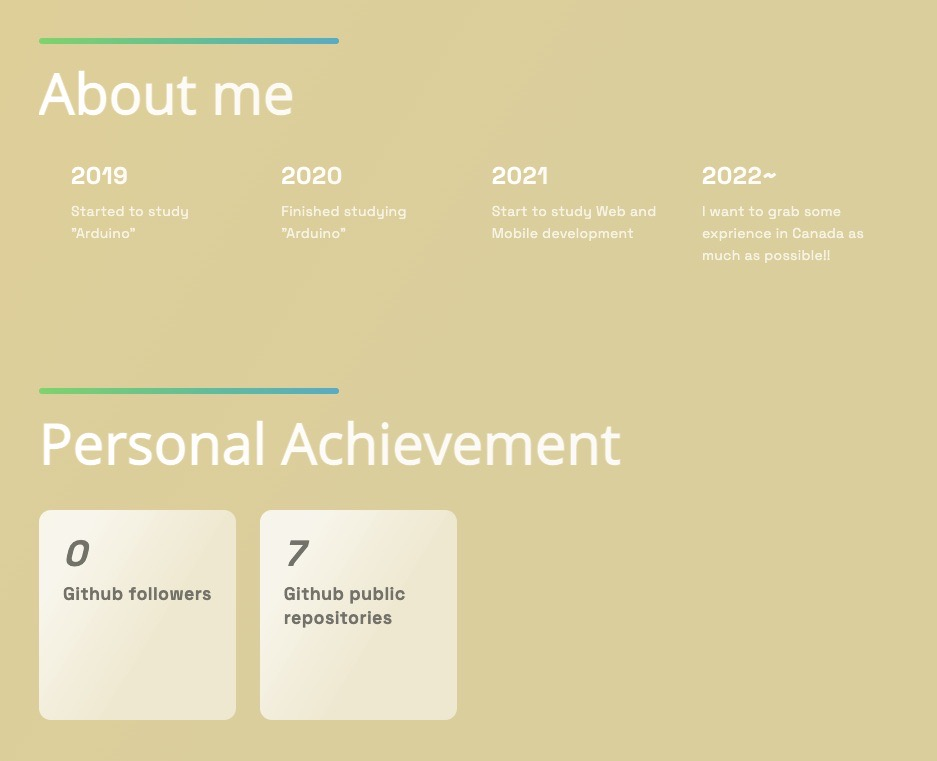
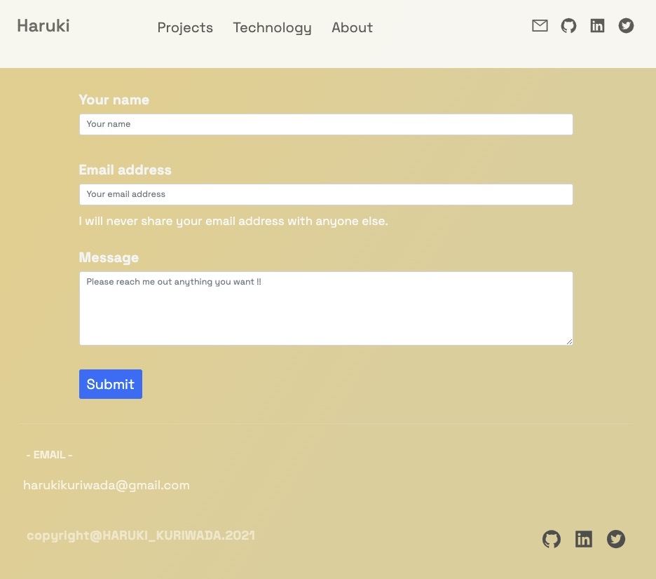

# My Portfolio 

### What I used in this project
⚡️ Next.js  
⚡️ Vercel  
⚡️ NodeJS  
⚡️ MongoDB  
⚡️ Github-API  

### 1. Landing(Main) page
- styled-component dependencies to use CSS to design page 
- using SWR library to first return the data from cache instead of using axios.
 
 
### 2. Show personal projects data
- connecting to MongoDB cloud and trigger the data.
   

### 3. Github status
- GithubAPI to show my github status.
   
  
### 4. Mail feature
- using NodeMailer dependencies send mail from website.
  

I want to create useful applications more and more ...!!
